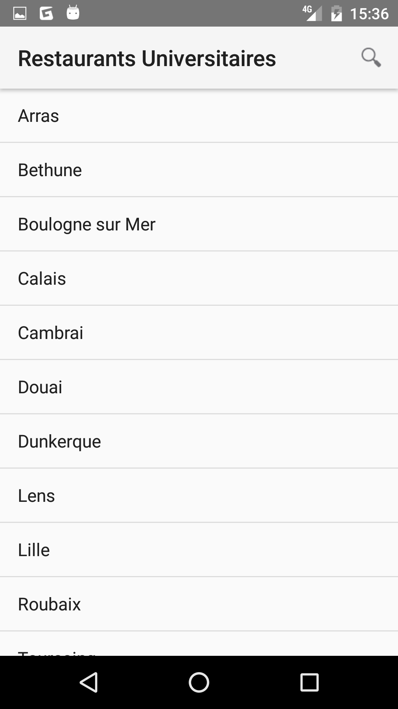
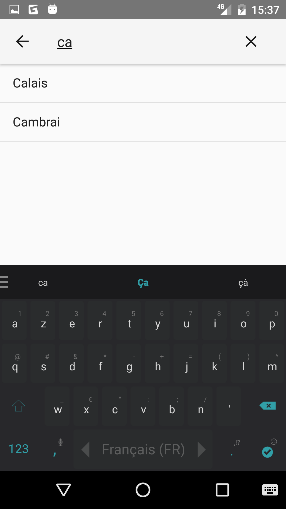
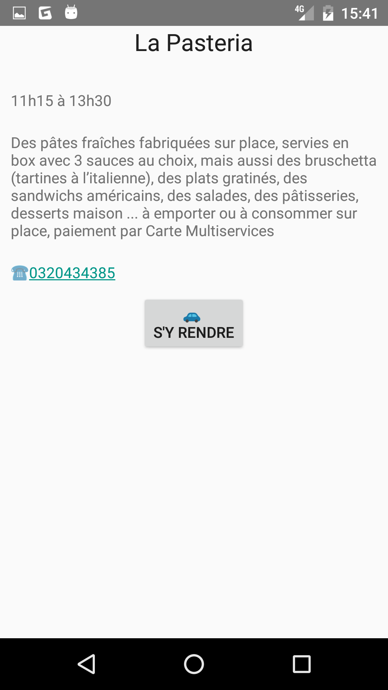

Introduction
-------------
Dans le cadre de la matière IFI - Android, nous avons réalisé une application permettant de trouver n'importe quel RU universitaire en france, accédant ainsi à sa description ainsi qu'un lien pour appeler ce dernier et un bouton qui lance un itinéraire de votre position actuelle jusqu'au RU de votre choix.

Binômes
-------------
Clement Maxime
Piorun Jordan

Screenshots
-------------

     

